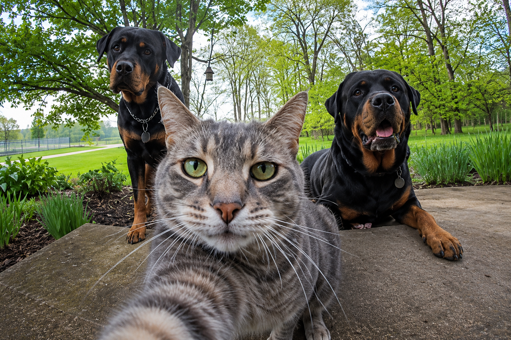
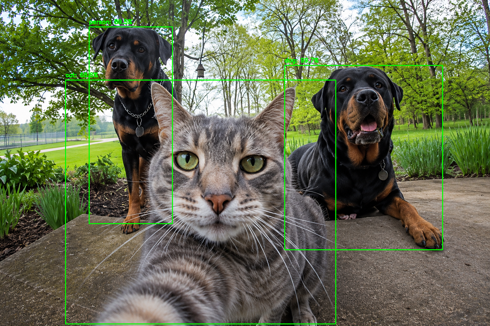
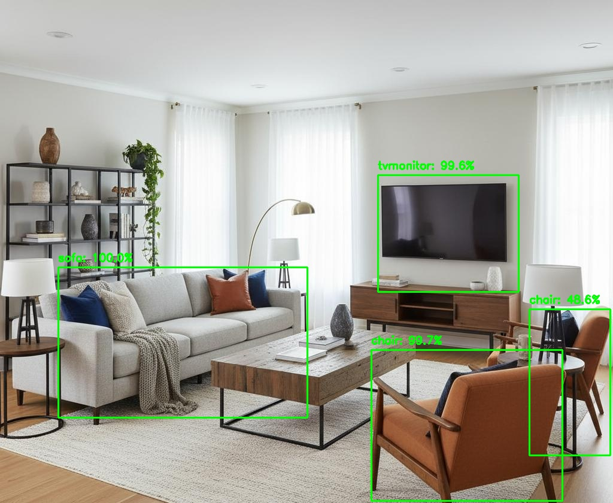
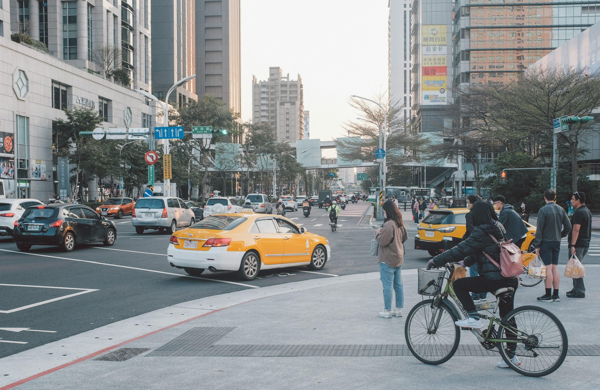
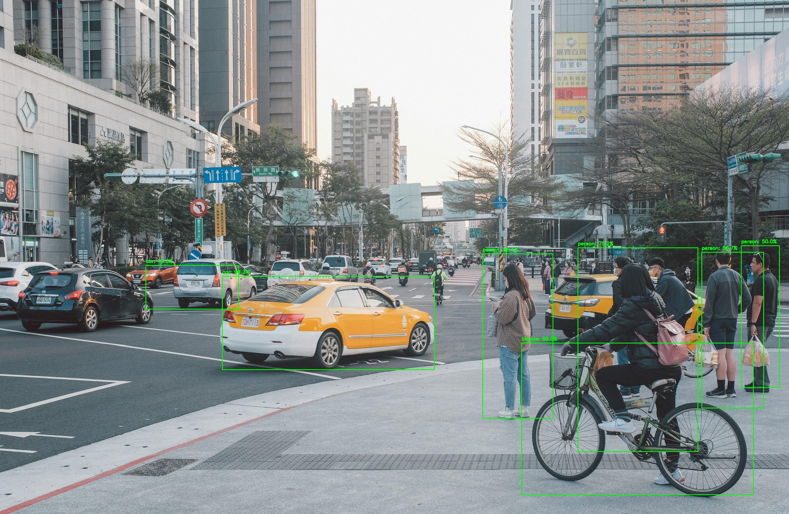

# 🖼️ Object Recognition Using OpenCV


A computer vision project built with OpenCV and the MobileNet SSD model to detect and classify multiple objects in static images.
---

# 🚀 Features

- Detect multiple objects in static images.
- Recognize different object categories using MobileNet SSD.
- Display object labels with confidence scores.
- Draw bounding boxes around detected objects.
- Automatically save processed images.
- Simple and easy-to-use Python implementation.

---

# 🛠️ Technologies Used

- Python
- OpenCV
- NumPy
- MobileNet SSD
- Anaconda
- Visual Studio Code

---

# 📂 Project Structure

```text
Object-Recognition-Using-OpenCV
│
├── images/
│   ├── Animals.png
│   ├── Room.jpg
│   └── Street.jpg
│
├── model/
│   ├── deploy.prototxt
│   └── mobilenet_iter_73000.caffemodel
│
├── results/
│   ├── detected_Animals.png
│   ├── detected_Room.jpg
│   └── detected_Street.jpg
│
├── object_recognition.py
└── README.md
```

---

# 🚀 Project Workflow

| Step | Description |
|------|-------------|
| **① Project Setup** | Organize the project folders and prepare the required files. |
| **② Model Loading** | Load the MobileNet SSD model using OpenCV DNN. |
| **③ Image Processing** | Read the input images and prepare them for object detection. |
| **④ Object Detection** | Detect supported objects and calculate confidence scores. |
| **⑤ Visualization** | Draw bounding boxes and display object labels on each image. |
| **⑥ Save Results** | Save the processed images automatically inside the `results` folder. |

---

# ⚙️ Installation & Usage

Follow the steps below to set up and run the project successfully.

### 1. Clone the Repository

Clone this repository to your local machine.

```bash
git clone https://github.com/sama-alzahrani/Object-Recognition-Using-OpenCV.git
```

---

### 2. Create and Activate a Virtual Environment

Create a dedicated Anaconda environment and activate it.

```bash
conda create -n object_recognition python=3.10
conda activate object_recognition
```

---

### 3. Install the Required Dependencies

Install the required Python libraries.

```bash
pip install opencv-python==4.10.0.84 numpy
```

---

### 4. Prepare the Model Files

Place the following MobileNet SSD model files inside the `model` folder.

```text
deploy.prototxt
mobilenet_iter_73000.caffemodel
```

---

### 5. Add Input Images

Place the images you want to analyze inside the `images` folder.

---

### 6. Run the Project

Execute the following command.

```bash
python object_recognition.py
```

---

### 7. View the Results

After execution, the program will automatically:

- Read the input images.
- Detect supported objects.
- Draw bounding boxes around detected objects.
- Display object labels with confidence scores.
- Save the processed images inside the `results` folder.

---

# 🧠 MobileNet SSD Supported Classes

The MobileNet SSD model used in this project supports detecting the following object categories.

| 👤 People & Vehicles | 🐾 Animals | 🏠 Indoor Objects |
|----------------------|------------|-------------------|
| Person • Bicycle • Car • Bus • Motorbike • Train • Boat • Aeroplane | Bird • Cat • Dog • Horse • Sheep • Cow | Bottle • Chair • Sofa • Dining Table • Potted Plant • TV Monitor |

---

# 📸 Object Detection Results

The following examples demonstrate the object detection results produced by the MobileNet SSD model.

---

## 🐱 Animals Image

### Supported Classes

`Cat` • `Dog` • `Person`

| Original Image | Detection Result |
|----------------|------------------|
|  |  |

### Detection Summary

| Object | Status |
|---------|--------|
| Cat | ✅ Detected |
| Dog | ✅ Detected |
| Person | ⚠️ Incorrect Prediction |

> **Note:** One dog was incorrectly classified as a person because the project uses a pre-trained MobileNet SSD model, which may occasionally produce inaccurate predictions.

---

## 🛋️ Living Room Image

### Supported Classes

`Sofa` • `Chair` • `TV Monitor`

| Original Image | Detection Result |
|----------------|------------------|
|  |  |

### Detection Summary

| Object | Status |
|---------|--------|
| Sofa | ✅ Detected |
| Chair | ✅ Detected |
| TV Monitor | ✅ Detected |

---

## 🚦 Street Image

### Supported Classes

`Person` • `Car` • `Bicycle`

| Original Image | Detection Result |
|----------------|------------------|
|  |  |

### Detection Summary

| Object | Status |
|---------|--------|
| Person | ✅ Detected |
| Car | ✅ Detected |
| Bicycle | ✅ Detected |

---

# 📊 Project Statistics

| Category | Value |
|----------|-------|
| Programming Language | Python |
| Framework | OpenCV |
| Deep Learning Model | MobileNet SSD |
| Input Images | 3 |
| Output Images | 3 |
| Detection Method | OpenCV DNN |

---

# ✅ Output

After running the project, the application will:

- Read all images from the `images` folder.
- Detect supported objects using MobileNet SSD.
- Draw bounding boxes around detected objects.
- Display object labels with confidence scores.
- Save the processed images automatically inside the `results` folder.

---

## 👩🏻‍💻 Author

**Sama Alzahrani**

Computer Engineering Student
